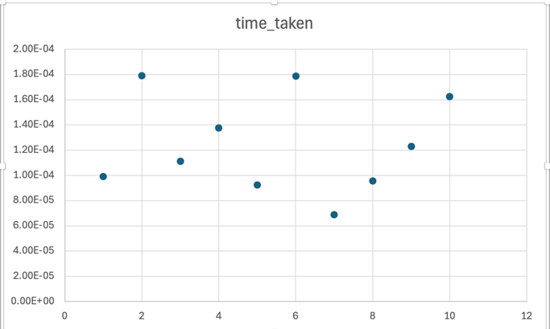
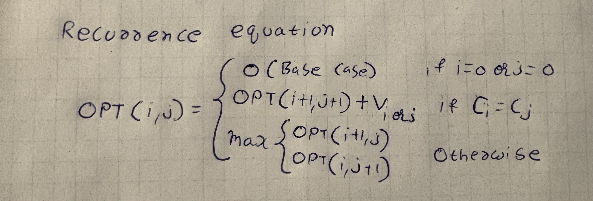

# COP4533_Programming_Assignment_3

# Names and UFIDs
Shane Downs: 92052913 Shashank Gutta: 70100558

# Instructions to run the code
1. Clone the repo
2. Open ./src/main.py
3. There are 2 types to run code, pleas uncomment the version you want
4. If chosen the single file option, then please enter the selected file name in the file_name variable
5. Hit run

# Solutions
Q1)

The input files were randomly generated 
using the input_generator.py found in the input folder.

The input strings A and B can range anywhere from 25 to 50.
Which resulted in the huge differences in runtime

Q2)

Base Case: dp[i][j] = 0 if i = len(A) or j = len(B)  

In the case that the index of either i = len(A) or j = len(B),  
this indicates that we've reached the end of the string thus 
there will be no common subsequence leading to the value 
being 0

Recurrence Validity:

The recurrence equation considers all possible sequences:

1. When A[i] = B[j]:  
In the event that the characters of both the strings match
we can include this character into the substring, thus we
can take its value and solve the subproblem of the next characters at
i+1 and j+1
2. When A[i] != B[j]:  
If the characters do not match then we solve the 
subproblems of the 2 situations possible:
   1. subproblem(i, j+1)
   2. subproblem(i+1, j)

    We then take the maxes of these 2 cases giving us the HVLCS

Q3) 
Pseudocode:

Input: DP11, ..., DPmn A1, ..., Am B1, ..., Bn V1, ..., Vk

i = 0 
j = 0 
result = "" 
while i < len(A) and j < len(B):

&nbsp;&nbsp;&nbsp;&nbsp; if Ai == Bj & dpij = dpi+1 j+1 + Vi/j</sub: 
&nbsp;&nbsp;&nbsp;&nbsp;&nbsp;&nbsp;&nbsp;&nbsp; result += Ai or Bj 
&nbsp;&nbsp;&nbsp;&nbsp;&nbsp;&nbsp;&nbsp;&nbsp; i += 1 
&nbsp;&nbsp;&nbsp;&nbsp;&nbsp;&nbsp;&nbsp;&nbsp; j += 1 

&nbsp;&nbsp;&nbsp;&nbsp; else:  
&nbsp;&nbsp;&nbsp;&nbsp;&nbsp;&nbsp;&nbsp;&nbsp; if dp[i + 1][j] > dp[i][j + 1]:  
&nbsp;&nbsp;&nbsp;&nbsp; &nbsp;&nbsp;&nbsp;&nbsp; &nbsp;&nbsp;&nbsp;&nbsp;  i += 1  
&nbsp;&nbsp;&nbsp;&nbsp;&nbsp;&nbsp;&nbsp;&nbsp; else:  
&nbsp;&nbsp;&nbsp;&nbsp; &nbsp;&nbsp;&nbsp;&nbsp; &nbsp;&nbsp;&nbsp;&nbsp; j += 1  
return result

Runtime : O(n*m)