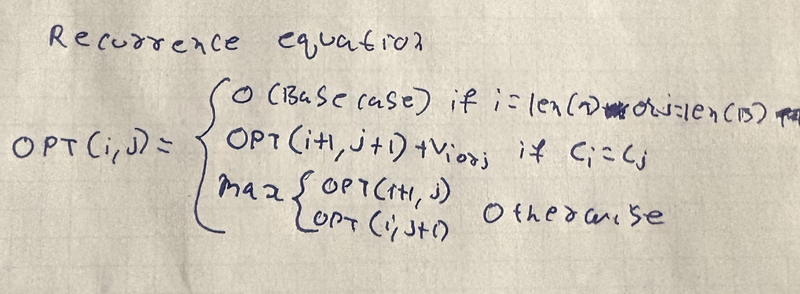

# COP4533 Programming Assignment 3

**Shane Downs** (UFID: 92052913) | **Shashank Gutta** (UFID: 70100558)

## Instructions

1. Clone the repo
2. `cd src`
3. To run all 10 test cases: `python main.py`
4. To run a single input file: `python main.py ../input/<filename>.in`
   - Output is automatically written to `output/<filename>.out`
   - Example: `python main.py ../input/example_input.in`

## Assumptions

- Input files follow the format specified in the assignment: first line is the number of characters K, followed by K lines of character-value pairs, then strings A and B
- All character values are non-negative integers
- Output files contain the maximum subsequence value on the first line and the subsequence string on the second line

## Repository Structure

```
├── input/                  # Input files
│   ├── example.in          # Example input
│   ├── input_1.in          # Test cases 1-10
│   └── ...
├── output/                 # Output files generated by the program
│   ├── output_1.out        # Results for test cases 1-10
│   └── ...
├── src/                    # Source code
│   ├── dp.py               # DP algorithm and backtracking
│   ├── main.py             # Entry point, reads input and writes output
│   └── input_generator.py  # Script used to generate test inputs
├── tests/
├── img.png                 # Runtime results screenshot
├── IMG_1.JPG               # Recurrence screenshot
└── README.md
```

## Solutions

### Q1


The input files were randomly generated using `src/input_generator.py`. The input strings A and B can range anywhere from 25 to 50, which resulted in the huge differences in runtime.

### Q2



**Base Case:** `dp[i][j] = 0` if `i = len(A)` or `j = len(B)`

In the case that the index of either `i = len(A)` or `j = len(B)`, this indicates that we've reached the end of the string thus there will be no common subsequence leading to the value being 0.

**Recurrence Validity:**

The recurrence equation considers all possible sequences:

1. **When `A[i] = B[j]`:** In the event that the characters of both the strings match, we can include this character into the substring, thus we can take its value and solve the subproblem of the next characters at `i+1` and `j+1`.
2. **When `A[i] != B[j]`:** If the characters do not match then we solve the subproblems of the 2 situations possible: `subproblem(i, j+1)` and `subproblem(i+1, j)`. We then take the maxes of these 2 cases giving us the HVLCS.

### Q3

```
Input: dp[0..m][0..n], A[0..m-1], B[0..n-1], char_values

i = 0
j = 0
result = ""

while i < len(A) and j < len(B):
    if A[i] == B[j] and dp[i][j] == dp[i+1][j+1] + char_values[A[i]]:
        result += A[i]
        i += 1
        j += 1
    else:
        if dp[i+1][j] > dp[i][j+1]:
            i += 1
        else:
            j += 1

return length(result)
```

**Runtime:** O(n * m)
